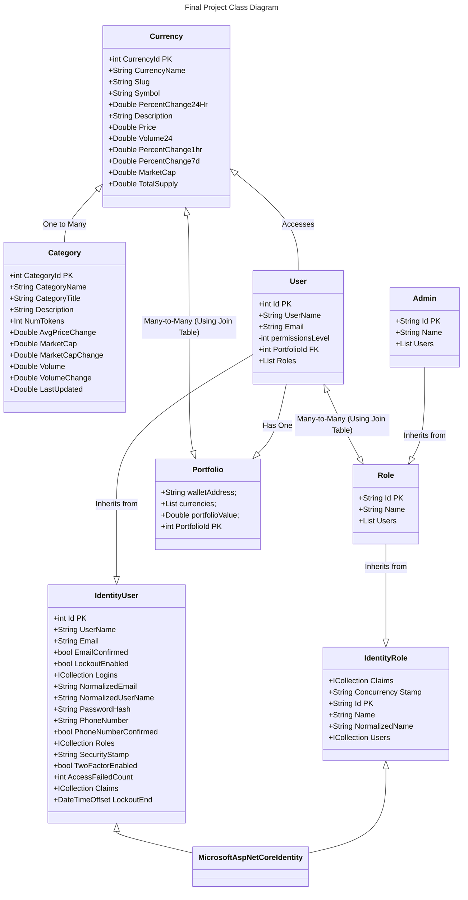

- Category model is based off the one used in by CoinMarketCap.
- Currency model is based off the one used in CoinMarketCap and uses Quartz.net to update the data
- User and Role are children of IdentityUser and IdentityRole which come from Microsoft.AspNetCore.Identity.
- User is connected with a many-to-many relationship to Role via the UsersRoles table
- Currency is connected with a many-to-many relationship to Portfolio via the CurrenciesPortfolios table

